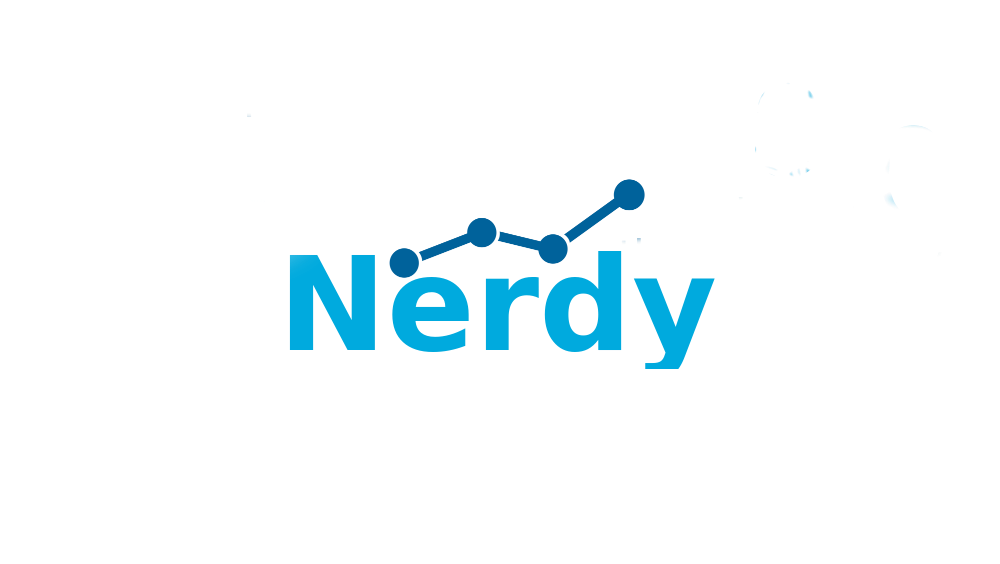

Nerdy provides different NER classifiers as a service in a common format, `NIF <http://persistence.uni-leipzig.org/nlp2rdf/>`_. Users can extract named entities from text they provide or use annotated documents to evaluate and compare the classifiers.

Nerdy uses Senpy, a software to create sentiment analysis web services easily developed at GSI UPM. 

Available classifiers
---------------------

- `Stanford classifier <http://nlp.stanford.edu/software/classifier.shtml>`_ : Spanish and English language.
- `Polyglot classifier <https://github.com/polyrabbit/polyglot>`_ : Spanish and English language.
- Citius classifier: For Spanish and English language.
- Ritter classifier: Only for english text.

Installation
------------
First, you need to install senpy. You could do this through PIP.

.. code:: bash

   pip install --user senpy

Then, you clone this repository and run a senpy server with nerdy plugin.

.. code:: bash

   git clone http://github.com/gsi-upm/nerdy
   cd nerdy
   python2 -m senpy -f .

The service is now available at port 5000.

Known issues
------------

- This software is developed in Python 2.7. So, the release of Senpy installed in your host must be python 2 release. (don't use pip3)
- To use Standford classifier with Nerdy, `Oracle Java 8 <https://www.java.com/es/download/help/linux_x64_install.xml>`_ is neccesary. 
- To use citius NER, please visit http://proxectos.citius.usc.es/hpcpln/index.php/en/software-tools. Move Citius_tools folder into classifiers folder.
.. image:: http://www.gsi.dit.upm.es/templates/jgsi/images/logo.png
   :height: 6em

